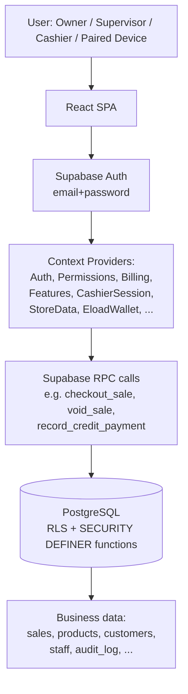
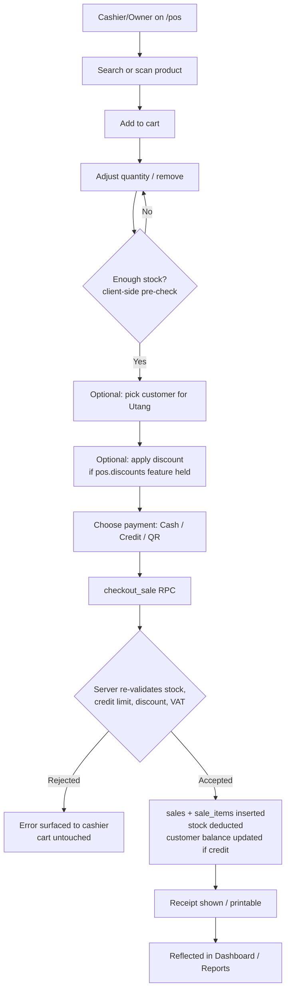
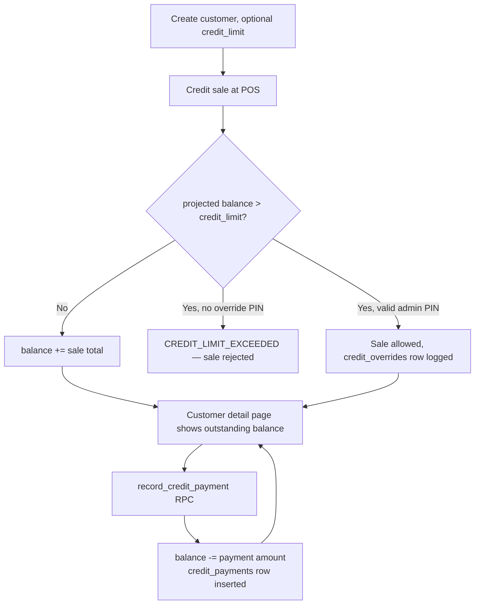
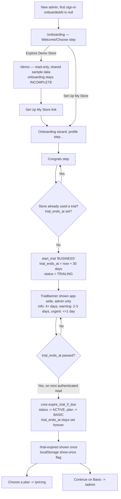
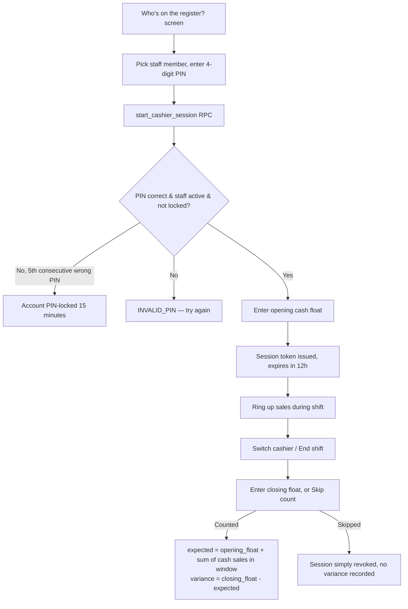

# Dells Software Tindahan POS
## Alpha QA Handoff Documentation

---

## 0. Document Purpose

This document is written for an **Independent AI QA Tester** with no prior context on this codebase and no ability to ask the original developer questions.

- This document is the **expected-behavior reference**, derived from reading the actual Alpha source code (React/TypeScript frontend, Supabase/PostgreSQL migrations, and the automated test suite). Originally written as of 2026-08-25 on the `feat/landing-header-dells-logo` branch; **updated 2026-08-29** to cover the Free Demo Store + Free Trial feature, Register-page changes (confirm-password field, Google sign-up), the account-deletion review queue, and a plan-naming discrepancy — all of which landed after the original pass. Sections carrying this update are marked `[Updated 2026-08-29]`.
- This document covers the **web app** (`apps/tindahan-pos`) only.
- The **live running application is the system under test**.
- If the live application disagrees with this document, **do not assume either one is correct** — record it as a `DOCUMENTATION VS APPLICATION DISCREPANCY` (format in §36) and move on. Do not silently "fix" this document to match what you observed, and do not assume the app is broken just because it differs from what's written here.
- Anything the codebase did not make clear is explicitly marked `UNKNOWN — Requires clarification.`, `PRESENT BUT NOT VERIFIED AS FUNCTIONAL`, or `IMPLEMENTED BUT CURRENTLY INACCESSIBLE`.

---

## 1. Application Overview

| | |
|---|---|
| **Application name** | Tindahan POS (part of the "Dells Software" product family) |
| **Version** | Alpha (`package.json` version field is literally `0.0.0` — no formal version number exists yet) |
| **Purpose** | Point-of-sale, inventory, and store-management SaaS for small Philippine retail stores, purpose-built around the **sari-sari store** (neighborhood convenience store) — including `utang` (informal customer credit), e-load/GCash cash-in-cash-out reselling, and pack pricing |
| **Target users** | Store owners/admins, supervisors, and cashiers of small Philippine retail businesses |
| **Business type** | Multi-tenant B2B SaaS — each registered "store" is an isolated tenant |
| **Application URL** | UNKNOWN — Requires clarification (no production URL found in the repo; deployment is via Vercel per `vercel.json`, but the actual domain is not in this codebase) |

### Technology stack (verified from source)

- **Frontend**: React 19.2 + TypeScript, built with Vite 8, styled with Tailwind CSS 4. Routing via `react-router-dom` v7 (`BrowserRouter`).
- **State/data**: A stack of nested React Context providers (see §6) — no Redux/Zustand/etc.
- **Backend**: Supabase (PostgreSQL + PostgREST + GoTrue auth + Storage + Edge Functions). All business logic of consequence lives in **Postgres functions (RPCs)** defined in `supabase/migrations/*.sql`, invoked from the client via `supabase.rpc(...)`. There is no separate Node/Express API layer in this app.
- **Auth**: Supabase Auth (email+password). Email confirmation may or may not be required depending on the Supabase project's own "Confirm email" setting (the client code branches on this — see §14 Step 2).
- **Database**: PostgreSQL via Supabase, with Row-Level Security (RLS) enforcing tenant isolation and most authorization.
- **Hosting**: Vercel (`vercel.json` present — rewrites `/` to a static `public/landing.html` marketing page, everything else to the SPA `index.html`; sets a strict CSP, HSTS, X-Frame-Options: DENY, etc.).
- **Notable dependencies**: `@supabase/supabase-js`, `exceljs` (Excel export), `html5-qrcode`/`qrcode` (barcode/QR scanning and generation), `react-router-dom` 7.
- **Testing**: Vitest (unit/component, `*.test.tsx`/`*.test.ts` colocated in `__tests__` folders) and Playwright (`e2e/*.spec.ts`). Both exist and are extensive — treat them as a secondary source of ground truth (see §26).

### Current Alpha scope

The Alpha build includes: authentication & self-registration, a Welcome/Choose step (Explore Demo Store vs. Set Up My Store) **[Updated 2026-08-29]**, a read-only isolated Demo Store **[Updated 2026-08-29]**, onboarding wizard, a 30-day free trial with severity-banded reminder banner and a one-time trial-expired screen **[Updated 2026-08-29]**, a Pricing/Upgrade page listing every real plan **[Updated 2026-08-29]**, POS checkout (cash/credit/QR/GCash-Maya reference), inventory & receiving, suppliers, customers/utang, staff & RBAC, cashier shifts/drawer, e-load & cash-in/cash-out/print-photocopy services, discounts, VAT/BIR receipt fields, void & partial refund, reports (with CSV export), plan/billing awareness (read-only from the app's perspective — actual billing/payment collection is out of scope for this app), device pairing (multi-register), audit log, self-service account deletion routed through a platform-admin review queue for a store's sole admin **[Updated 2026-08-29]**, and a settings area covering store identity, receipts, fees, alerts, backup, devices, and plan.

Do **not** assume: BIR full compliance/accreditation, real payment gateway integration (GCash/Maya are recorded as a manual reference number, not processed), a native mobile app, or a public REST API for third parties. None of these exist in this codebase.

---

## 2. Application Architecture

### High-level flow



### Frontend architecture

- Entry: `src/App.tsx`. A single `<BrowserRouter>` wraps two route groups: public (`/login`, `/register`, `/forgot-password`, `/pair`) and protected (everything else, behind `<ProtectedRoute>`).
- Provider nesting (outer → inner), all in `src/App.tsx`: `NetworkProvider` → `FeatureFlagsProvider` → `AuthProvider` → `PermissionsProvider` → `BillingProvider` → `FeaturesProvider` → `CashierSessionProvider` → `StoreDataProvider` → `OfflineQueueProvider` → `EloadWalletProvider` → `DrawerFloatProvider` → the router.
- `ProtectedRoute` (`src/components/ProtectedRoute/ProtectedRoute.tsx`) is a **layout route** (renders `<Sidebar>`/`<MobileHeader>`/`<BottomNav>` once, swaps only `<Outlet/>`). It handles four states: loading (spinner), auth error (retry screen), a paired **device session** with no human user (locked to `/pos` only, no chrome), and a signed-in staff `user` (full shell). An admin who hasn't finished onboarding (`user.onboardedAt` is null) is redirected to `/onboarding` from any other route.
- Forms are plain controlled React state (`useState` + custom hooks per page, e.g. `useLoginForm`, `useRegisterForm`) — no form library (no Formik/React Hook Form).
- API communication is exclusively through the `supabase-js` client (`src/lib/supabaseClient`) — either `.from(table).select/insert/update()` (PostgREST, governed by RLS) or `.rpc(functionName, args)` (calls a Postgres function, usually `SECURITY DEFINER`).
- Auth state lives in `AuthProvider` (`src/lib/auth/auth.tsx`), which is the single source of truth for `user` (a `StaffAccount`), `deviceSession` (a paired register), and `store`.

### Backend architecture

- No custom Node/Express server. All server logic is either:
  1. A PostgreSQL function in `supabase/migrations/*.sql`, callable via RPC, mostly `SECURITY DEFINER` with explicit `revoke/grant` statements limiting execution to `authenticated`.
  2. Row-Level Security policies on tables, scoping every read/write to `store_id = auth_store_id()` (the caller's own store) and further gating writes by role/permission.
  3. A small number of Supabase Edge Functions — confirmed: `delete-account` (self-service account deletion) and a "create-cashier" Edge Function referenced in code comments (creates a `role: 'cashier'` staff account with a generated password, never `owner`). Exact Edge Function source files were not located inside `apps/tindahan-pos` in this pass — **PRESENT BUT NOT VERIFIED AS FUNCTIONAL** from this repo alone; verify their existence/deployment against the live Supabase project.
- Migrations are broadly organized in two eras: an early sequential set (`0001`–`0045`, `..._rbac_enforce_checkpoints.sql` etc.) building the original single-tenant-per-store schema (`stores`, `staff`, `products`, `sales`, ...), and a later, timestamped set (`20260815090000_...` onward) layering a `core` schema (organizations/branches/modules/features/plans/platform-admin) on top — largely a **billing/entitlement/multi-branch platform layer**, much of which is console/platform-admin-facing rather than end-user-facing in this specific app. Treat the `core.*` schema objects as infrastructure the app's RPCs call into (e.g. `current_store_has_feature`), not as something a QA tester interacts with directly.

### Database — key entities (table name → purpose → key fields → who uses it)

| Table | Purpose | Key fields | Used by module |
|---|---|---|---|
| `stores` | One row per tenant | `name`, `fee_config` (jsonb), `tin`, `business_permit_no`, `bir_registered`, `vat_status`, `vat_rate`, `invoice_type`, `cashier_can_edit_prices` | Settings, receipts, VAT calc everywhere |
| `staff` | Human accounts belonging to a store | `role` (`admin`\|`cashier` enum), `pin_hash`, `pin_failed_attempts`, `pin_locked_until`, `onboarded_at`, `active` | Auth, Staff, ProtectedRoute |
| `roles` / `permissions` / `role_permissions` / `staff_roles` | Granular RBAC layer on top of `staff.role` | Seeded system roles `OWNER`/`SUPERVISOR`/`CASHIER`; 11 permission codes (§9) | Staff, has_permission() everywhere |
| `devices` | Paired registers (Phase 3 "multiple registers") | `name`, `unpaired_at` | Pair page, ProtectedRoute device-session path |
| `products` | Catalogue | `barcode`, `price`, `stock`, `low_stock_threshold`, `pack_quantity`/`pack_price`, `cost` | Inventory, POS, Receiving |
| `categories` | Product grouping | `name` | Inventory, POS filters |
| `customers` | Utang ("suki") accounts | `credit_limit`, `balance` (running total, server-maintained only) | Customers, POS credit sale |
| `credit_payments` | Append-only ledger of utang payments | `amount`, `note`, `created_by` | Customers |
| `credit_overrides` | Record of an admin PIN override that let a sale exceed a customer's credit limit | `previous_balance`, `credit_limit`, `resulting_balance`, `approved_by` | POS checkout audit trail |
| `sales` | One row per completed (or voided) transaction | `total`, `payment_type` (`cash`\|`credit`\|`qr`), `status` (`completed`\|`voided`), `receipt_number`, `discount_type`/`discount_value`/`discount_amount`, VAT snapshot fields (`vat_status`, `vat_rate`, `vatable_sales`, `vat_amount`, `vat_exempt_sales`, `zero_rated_sales`), `device_id`, `client_request_id` (idempotency key), `occurred_at` (for offline replay) | POS, Reports, Dashboard |
| `sale_items` | Line items of a sale | `product_id` (nullable — set null if product later deleted), `quantity`, `price`, `item_type` (`product`\|`service`), `fee`, `line_total` | POS, Reports, refunds |
| `refunds` / `refund_items` | Append-only partial-refund ledger, referencing an original sale | `reason`, `total_amount`, per-line `quantity`/`amount` | Reports (void/refund actions) |
| `document_series` | Per-store sequential receipt/invoice numbering | `next_number`, `prefix` | checkout_sale() receipt numbering |
| `cashier_sessions` | One row per cashier shift ("PIN login") | `token`, `opening_float`, `closing_float`, `expected_closing`, `variance`, `expires_at`, `revoked_at` | Shift/drawer flow (Staff page) |
| `audit_log` | Structured record of sensitive actions | `action` (e.g. `sale_created`, `sale_voided`, `sale_refunded`), `previous_value`/`new_value` (jsonb), `reason` | Settings → Audit Log, void/refund |
| `stock_discrepancies` | Deficit recorded when an offline-replayed sale oversold stock | `deficit` | Offline queue reconciliation |
| `suppliers` | Supplier directory | `payment_terms` (`cash`\|`7_days`\|`15_days`), `scan_code` (QR), `usual_delivery_days`, `active` | Suppliers, Receiving |
| `feature_flags` | Global boolean toggles (e.g. `pack_pricing`) | `key`, `enabled` | checkout_sale(), pack pricing UI |
| `demo_products` / `demo_sales` / `demo_customers` **[Updated 2026-08-29]** | Fixed, shared sample dataset for the read-only Demo Store — **no `store_id` column at all**; every signed-in user sees the identical rows | seeded ~8 products / 5 sales / 3 customers | `/demo` page only, never joined to any real store |
| `core.organization_subscriptions` **[Updated 2026-08-29]** | Per-org subscription/trial state (in the `core` schema, not `public`) | `status` (`TRIALING`\|`ACTIVE`\|...), `trial_ends_at` (permanent one-time-trial marker, never cleared), `plan_id` | `start_trial()`, `my_store_billing_state()`, TrialBanner, TrialExpired, Pricing |
| `core.account_deletion_requests` **[Updated 2026-08-29]** | A sole admin's filed request to delete their account, reviewed by a platform admin in the separate Super Admin console | `status` (`PENDING`\|`APPROVED`\|`DENIED`), `requested_email`, `reason`, `resolution_note` | `delete-account` Edge Function (files), `approve-deletion-request` Edge Function (resolves) — **not reachable from this app's own UI**, see §16.1 |

Do **not** expose or attempt to read: Supabase project URL/anon key/service-role key, `.env` values, or any secret. None are reproduced in this document.

---

## 3. Detailed Business Flows

### POS checkout flow



### Utang (credit) lifecycle



### Free Demo Store + Free Trial lifecycle **[Updated 2026-08-29]**



### Cashier shift (drawer) lifecycle



---

## 4. Module Inventory

Derived from `src/App.tsx` (routes), `src/pages/`, and `src/lib/nav.ts` (which routes actually appear in navigation, and to which role/permission/feature they're gated).

| Module | Route | Purpose | Roles that can navigate to it | Gated by |
|---|---|---|---|---|
| Login | `/login` | Sign in | Public | — |
| Register | `/register` | Self-service owner signup | Public | — |
| Forgot Password | `/forgot-password` | Password reset email | Public | — |
| Pair (device) | `/pair` | Pair a tablet/till as a register with no human login | Public (needs a pairing code from an existing admin session — pairing code generation mechanism not directly located in this pass; **UNKNOWN — Requires clarification** on exactly where an admin generates the 6-character code) | — |
| Dashboard | `/admin` | Owner's home screen: today's sales, best sellers, low stock, restocking, utang, subscription card | admin only | `roles: ["admin"]` |
| POS | `/pos` | Ring up sales | admin, cashier (and a bare paired device) | `roles: ["admin","cashier"]` |
| Inventory | `/inventory` | Product/category CRUD, stock levels | admin, cashier | `roles: ["admin","cashier"]` (no extra permission gate in nav; server-side write policies differ, see §9) |
| Receiving | `/inventory/receiving` | Record incoming stock | admin, cashier | reachable via Inventory; no separate nav-gated permission found in `nav.ts` (route exists but has no dedicated nav entry — reachable by direct URL / in-page link only) |
| Staff | `/staff` | Manage staff accounts, roles, shifts, drawer variance | admin only | `roles: ["admin"]` + permission `staff.manage` |
| Customers | `/customers` | Utang customer list, balances, payments | admin, cashier | `roles: ["admin","cashier"]` + feature `pos.utang` |
| Suppliers | `/suppliers` | Supplier directory | admin, cashier (both roles pass the route guard — no dedicated nav entry today, comment in `nav.ts` explicitly notes "reachable only by direct URL") | — |
| Reports | `/reports` | Sales reports, VAT, void/refund, Z-reading, exports | admin only | `roles: ["admin"]` + permission `pos.report.view` |
| Settings → Profile | `/settings/profile` | Own name/phone/address/avatar, PIN, password | Any signed-in staff | — |
| Settings → Store | `/settings/store` | Store name/address/photo/contact/BIR fields | admin (implied — needs verification per-page; **UNKNOWN** whether a cashier can view this page and just can't submit, or is blocked entirely) | — |
| Settings → Receipts | `/settings/receipts` | Receipt numbering/footer/what-to-include | admin (assumed) | — |
| Settings → Fees & limits | `/settings/fees` | E-load/cash-in/cash-out fee brackets, cash/credit limits | admin (assumed) | — |
| Settings → Alerts | `/settings/alerts` | Low-stock and money alert thresholds | admin (assumed) | — |
| Settings → Backup | `/settings/backup` | Automatic backup configuration, restore | admin (assumed) | — |
| Settings → Devices | `/settings/devices` | List/unpair paired registers | admin (assumed) | — |
| Settings → Plan | `/settings/plan` | Current subscription tier, upgrade request | admin (assumed) | — |
| Settings → Audit Log | `/settings/audit-log` | Sensitive-action history | admin (assumed) | — |
| Onboarding | `/onboarding` | First-run wizard for a new admin — first step is now a Welcome/Choose screen (Explore Demo Store vs. Set Up My Store) **[Updated 2026-08-29]** | admin, only if `onboardedAt` is null | `<OnboardingRoute>` wrapper |
| Demo Store **[Updated 2026-08-29]** | `/demo` | Read-only, isolated sample sari-sari store ("Aling Nena's Sari-Sari Store") — 3 metric tiles, product list, recent sales, customers with utang. No checkout, no edits, nothing persists. | Any signed-in staff (RLS: `select ... using (true)`, not store-scoped) | — |
| Pricing / Upgrade **[Updated 2026-08-29]** | `/pricing` | Lists every active real plan (`plan_prices()` RPC) with feature bullets; starts a 30-day trial for BUSINESS/PRO if the store hasn't used one yet | Any signed-in staff (authenticated only, no anon pricing) | — |
| Trial Expired **[Updated 2026-08-29]** | `/trial-expired` | One-time transitional screen shown once after a trial lapses; "Choose a plan" or "Continue on Basic" | admin only, shown once per trial (localStorage-tracked) | `useTrialExpiredRedirect()` in `ProtectedRoute` |

Root `/` is intercepted before it ever reaches the SPA — both `vite.config.ts` (dev/preview) and `vercel.json` (production) rewrite a fresh HTTP request for `/` straight to the static marketing page `public/landing.html`. The React route for `/` (`Navigate to="/pos"`) only fires for a client-side navigation that happens to target `/` from inside an already-mounted SPA.

**Settings page role-gating**: this document's Settings rows above are marked "(admin, assumed)" because the individual Settings sub-pages were not each traced for an explicit role check in this pass — they sit behind the same generic `<ProtectedRoute>` as everything else, and their *content* editing capability appears admin-oriented by convention (matching Store, Customers, Products edit policies elsewhere in the app), but a QA tester should explicitly verify whether a plain cashier can reach each Settings sub-route by direct URL and what they see. Treat this as `UNKNOWN — Requires clarification` per sub-page until verified.

---

## 5. User Roles

The codebase has **two role systems layered on top of each other** — do not conflate them:

1. **`staff.role`** (the hard, structural role): `"admin"` or `"cashier"` only. This is what `nav.ts` and `ProtectedRoute` gate on. There is no third structural role — "Owner" *is* `role = 'admin'`, and only the person who self-registers (`handle_new_user()` on signup) ever gets `admin`. The Staff → Add Staff modal **cannot create another admin/owner account** — its role picker intentionally only offers Cashier/Supervisor (see `roleselector/RoleSelector.tsx`, which has an explicit comment that "owner" was removed because the create-cashier Edge Function never creates one).
2. **Granular RBAC** (`0044_rbac_foundation.sql`): a `cashier`-role staff member can additionally be assigned one of two seeded **system roles** via `staff_roles`: `CASHIER` (default, holds none of the 11 extra permission codes) or `SUPERVISOR` (holds all 11 except `staff.manage`). `has_permission(code)` returns true unconditionally for anyone with `staff.role = 'admin'` (an admin needs no `staff_roles` row).

### Role reference

| Role (as used in UI) | Structural `staff.role` | RBAC system role | Purpose |
|---|---|---|---|
| **Owner** | `admin` | `OWNER` (implicit — an admin holds every permission without needing a `staff_roles` row) | Full control: staff, settings, reports, plan, everything |
| **Supervisor** | `cashier` | `SUPERVISOR` (assigned via Staff → role picker) | A trusted cashier upgraded with: void sales, view reports, refund sales, adjust/receive/count stock, manage products/suppliers/warehouses/purchase orders/transfers — everything except `staff.manage` |
| **Cashier** | `cashier` | `CASHIER` (default, no extra grants) | Ring up sales, sell on utang within limit, e-load cash-in, needs-PIN for void/price changes; cannot view reports or manage staff |
| **Paired Device** | none (no `staff` row at all — a `devices` row instead) | n/a | A bare register with a real Supabase Auth session but no human behind it; locked to `/pos` only |

### Permission matrix

Permission codes are literal strings checked via `has_permission('<code>')` server-side and mirrored client-side via `useCan('<code>')`. Full list (from `0044_rbac_foundation.sql` + `pos.sale.refund` added later in `20260815131000_refund_return.sql`):

`staff.manage`, `pos.sale.void`, `pos.sale.refund`, `pos.report.view`, `inventory.product.manage`, `inventory.supplier.manage`, `inventory.warehouse.manage`, `inventory.transfer.manage`, `inventory.purchase_order.manage`, `inventory.stock.adjust`, `inventory.stock.receive`, `inventory.stock.count`.

| Feature | Owner | Supervisor | Cashier |
|---|---|---|---|
| Dashboard (`/admin`) | Yes | No (route not in cashier's role list at all) | No |
| POS — ring up sales | Yes | Yes | Yes |
| POS — sell on utang (within limit) | Yes | Yes | Yes |
| POS — void a sale | Yes | Yes (`pos.sale.void`) | No |
| POS — refund/return part of a sale | Yes | Yes (`pos.sale.refund`) | No |
| POS — edit a product's price at register | Yes | Governed by `store.cashierCanEditPrices` toggle, not RBAC (see below) | Governed by `store.cashierCanEditPrices` toggle |
| Inventory — view products/stock | Yes | Yes | Yes |
| Inventory — manage products/suppliers/warehouses/transfers/purchase orders/stock adjust/receive/count | Yes | Yes (all the `inventory.*` codes) | No |
| Customers / Utang | Yes | Yes | Yes |
| Staff management (`/staff`) | Yes | No (`staff.manage` withheld even from Supervisor by design) | No |
| Reports (`/reports`) | Yes | Yes (`pos.report.view`) | No |
| Settings | Yes | `UNKNOWN — Requires clarification` per sub-page (§4) | `UNKNOWN` |
| Cash-out at register | "needs-pin" placeholder in Staff page's `cashierPermissions()` — explicitly commented in `lib.ts` as having **no real server-side enforcement mechanism today**; treat as `IMPLEMENTED BUT CURRENTLY INACCESSIBLE` / aspirational |

**Important nuance on price editing**: `store.cashierCanEditPrices` is a single **per-store** boolean (in `stores` table), admin-editable, enforced server-side by a `guard_cashier_product_update` trigger (`0043_cashier_price_edit_permission.sql`) — it is not part of the RBAC permission list and applies identically to Cashier and Supervisor roles (i.e. a Supervisor does not automatically get price-edit rights beyond what the store toggle allows).

---

## 6. Test Accounts

**These accounts now exist**, created directly against the **staging** Supabase project (`qfkdecarbqwbpkzqqdxk` / "DellsSoftware-staging") — never production. All three share the store "QA Test Store" (created automatically as part of the Owner's self-registration), so QA data is isolated from any real tenant.

| Account | Role | Email | Password | Purpose |
|---|---|---|---|---|
| QA Owner | Owner (`admin`) | `lyndell.dobluis+qa-owner@gmail.com` | `QaOwner!2026Test` | Full app testing: Dashboard, Staff, Settings, Reports, Plan |
| QA Supervisor | Cashier + `SUPERVISOR` role | `lyndell.dobluis+qa-supervisor@gmail.com` | `QaSupervisor!2026Test` | Void/refund, reports, inventory-manage permission testing |
| QA Cashier | Cashier (default, no extra role grant) | `lyndell.dobluis+qa-cashier@gmail.com` | `QaCashier!2026Test` | POS/utang-within-limit/needs-PIN-blocked-action testing |

Notes for the tester:

- These are real Gmail **plus-addressed** aliases off one real inbox (used only because this Supabase project requires email confirmation on signup, and `@example.test`-style addresses are rejected as invalid by Supabase's own email validation) — they are not disposable "no such domain" addresses. Do not repurpose them for anything other than this QA effort.
- The Supervisor and Cashier accounts were created via the app's own `create-cashier` Edge Function (the same path "Add Staff" in Settings → Staff uses), authenticated as the QA Owner — so they are fully real staff rows in staging, not fixtures inserted by hand.
- **No PIN is set yet** on any of these accounts — PIN-based quick-switch cashier login (§14) and the owner-approval-PIN override flow (§17) both need a PIN first. Sign in as QA Owner → Settings → Staff → set a PIN for QA Cashier/QA Supervisor (or sign in as each and set their own PIN under Settings → Profile → Signing in), and set the QA Owner's own PIN the same way (needed for the credit-limit-override flow).
- **No device is paired yet.** If a "paired device / bare register" test is needed, pair one live during testing via `/pair` (Login page → "Pair a device") using a pairing code generated from Settings → Devices while signed in as QA Owner.
- If any of these accounts stop working (e.g. staging gets reset), recreate them via `/register` (Owner) and Settings → Staff → Add Staff (Supervisor/Cashier) — do not invent new credentials without documenting them here.
- **`[New 2026-08-29]`** These three accounts are already onboarded (`onboardedAt` set) from prior testing, so they will **not** show the new Welcome/Choose screen (§9.1) or be eligible to start a fresh trial (`start_trial` is one-time-per-store, and this store may already have `trial_ends_at` set from earlier work). To test FLOW-029/030/031 (Welcome/Choose, Explore Demo, trial start) as a genuinely fresh signup, register a **new** `QA Trial Test` store via `/register` rather than reusing QA Owner — do not repurpose QA Owner's store for this, since it would consume its one-time trial and make future re-tests of the trial-start flow impossible on that store.
- **Which frontend URL to point the browser at**: this document's own §1 "Application URL" row is `UNKNOWN` — the frontend's staging deployment domain wasn't discoverable from the repo itself (only the Supabase *backend* project, `qfkdecarbqwbpkzqqdxk`, is known, and that's what these accounts live in). Get the staging frontend URL from the engineering team before testing, or run the app locally with `npm run dev` from a checkout whose `.env` is linked to this same staging project.

---

## 7. Test Data

### Categories
- `QA Beverages`
- `QA Snacks`
- `QA Grocery`

(Product categories are simple `{ name }` rows, admin-manageable via the Category Manager component in Inventory.)

### Products

Field reference from `Product` type (`src/lib/types.ts`): `name`, `barcode` (nullable), `price`, `stock`, `lowStockThreshold`, `categoryId`, `packQuantity`/`packPrice` (nullable, both-or-neither), `cost` (nullable, preview-only, never used in margin reporting), `imageUrl`.

| Product | Price | Stock | Reorder threshold | Notes |
|---|---|---|---|---|
| QA Test Product Normal | ₱100.00 | 20 | 5 | Baseline case |
| QA Test Product Low Stock | ₱50.00 | 2 | 5 | `stockStatus()` returns `"low"` when `0 < stock <= lowStockThreshold` |
| QA Test Product Out Of Stock | ₱75.00 | 0 | 5 | `stockStatus()` returns `"out"` when `stock <= 0` |
| QA Test Product High Value | ₱10,000.00 | 1 | 1 | Large-amount / receipt-formatting testing |
| QA Test Product Pack Pricing | ₱2.00 (per-unit fallback) | 30 | 5 | Set `packQuantity=3`, `packPrice=5` — "3 pcs for ₱5.00"; only applies if the `pack_pricing` feature flag is enabled (defaults to enabled if the flag row is absent) |
| QA Test Product Barcode | ₱25.00 | 15 | 5 | Give it a real-looking barcode string, use with the barcode scanner / manual entry |
| QA Test Product Zero Price | ₱0.00 | 10 | 5 | Edge case — verify whether ₱0 is accepted at all (no explicit `price > 0` guard was found on the product create path in this pass — `UNKNOWN`, verify) |

### Customers (see §8)

---

## 8. Customer Test Data

`Customer` type: `name`, `phone` (nullable), `creditLimit` (nullable), `balance` (server-maintained, starts at 0, never client-settable — see the known issue in §29 about the "opening balance" field).

| Customer | Purpose | Credit limit |
|---|---|---|
| QA Customer Regular | Cash transaction testing (payment type `cash`) | n/a |
| QA Customer Credit | Utang testing — normal within-limit sales and payments | ₱1,000 |
| QA Customer NoLimit | Credit sale with `credit_limit = null` — verify `CREDIT_LIMIT_EXCEEDED` never fires (per `checkout_sale()`, a null limit means unlimited) | (none set) |
| QA Customer AtLimit | Credit-limit-exceeded / admin-PIN-override testing | ₱200 |

---

## 9. Complete Application Walkthrough

### Step 1 — Open the application

- A fresh browser visit to the site root (`/`) serves the static marketing landing page (`public/landing.html`), not the SPA. It has its own CTAs (verified to exist, content not reproduced here beyond structure) including links into `/register` (optionally carrying a `?plan=BUSINESS` or `?plan=PRO` query param that pre-selects a plan on the Register screen).
- `/login` and `/register` are the two entry points into the SPA itself.

### Step 2 — Registration (owner self-signup)

Route: `/register` (`src/pages/Register/Register.tsx` + `hooks.tsx`).

Fields: **Store name** (required, plain text), **Owner name** (required, plain text), **Email** (required, `type=email`, must match `/^[^\s@]+@[^\s@]+\.[^\s@]+$/` for the client-side green-check indicator), **Password** (required, `minLength={8}`, live strength meter scoring 0–4 based on length≥8 / mixed case / digit / symbol), **Confirm password** (required, same show/hide-eye UI as Password; submit is blocked with an inline error if the two don't match) **[Updated 2026-08-29 — previously there was no confirm-password field]**, and a **"I agree to the Terms of Service and Privacy Policy"** checkbox, which now renders *above* both the "Sign up with Google" button and the form (previously below the form) **[Updated 2026-08-29]** — submit and the Google button are both disabled until it's checked, and clicking either while unchecked now shows a visible error instead of doing nothing.

A real, working **"Sign up with Google"** button sits between the checkbox and the form — see the Login step below for its current (no longer disabled) status **[Updated 2026-08-29]**.

On submit, client-side validates: all three text fields non-empty, password ≥8 chars — then calls Supabase `auth.signUp()` with `store_name`/`owner_name` as user metadata (a `handle_new_user()` trigger, referenced in code comments, is expected to create the `stores` and `staff` rows server-side from that metadata — the trigger's own SQL was not located by filename search in this pass; **UNKNOWN — Requires clarification**, verify a store+staff row is actually created on signup).

**Expected behavior**:
- If the Supabase project has "Confirm email" enabled: signup succeeds but returns no session → user sees a "confirmation sent" screen (`ConfirmationSentScreen`) and **cannot proceed** until they click the email link. A `?plan=` trial is *not* started in this path (documented in code as deliberately deferred).
- If email confirmation is off (or already confirmed): the user is immediately signed in and redirected to `/pos`. If a `?plan=BUSINESS` or `?plan=PRO` was carried in, a best-effort `start_trial` RPC fires in the background (failure here is silently swallowed and does not block navigation).
- Duplicate email → error "An account with that email already exists." (from `friendlyAuthError()`).
- New admins land at `/onboarding` on next visit until they complete it (`onboardedAt` is null) — **verify**: does a brand-new registration redirect straight to `/onboarding`, or to `/pos` first? Per `ProtectedRoute`, any protected route hits the onboarding redirect check, so it should be `/onboarding` immediately after the confirmed-session path.

### Step 3 — Login

Route: `/login`.

Fields: Email, Password, "Keep me signed in" checkbox (toggles Supabase session persistence between `localStorage` and a non-persistent/session-only mode), "Forgot password?" link, a **working** "Continue with Google" button (real `supabase.auth.signInWithOAuth({ provider: "google", ... })` call — **`[Updated 2026-08-29]` this is no longer disabled; KI-003 below is resolved**), and a "Set up this device" link to `/pair`. A new Google user gets the same `handle_new_user()` store-creation trigger as a password signup and lands in the same onboarding wizard.

**Environment caveat**: the OAuth `redirectTo` is correctly computed client-side from `window.location.origin`, but Supabase only honors it if that origin is in the project's Auth **Redirect URLs allow-list** (Supabase Dashboard → Authentication → URL Configuration), and only falls back to the project's **Site URL** otherwise. If Google sign-in on a given environment redirects to `localhost` after a successful Google login, that is a **Supabase Dashboard configuration issue for that environment, not an application code bug** — report it as an environment/config discrepancy, not a code defect.

**Expected behavior**:
- Valid credentials → signed in, redirected per `ProtectedRoute`'s logic (admin without onboarding → `/onboarding`; otherwise the requested route or `/pos`).
- Invalid credentials → error "Incorrect email or password." rendered inline with `role="alert"`.
- A best-effort `log_staff_auth_event` RPC fires on both login and logout for audit purposes; its failure never blocks sign-in/out.

### Step 4 — Onboarding (first-run wizard, admin only)

Route: `/onboarding`, wrapped in `<OnboardingRoute>`. **`[Updated 2026-08-29]`** The wizard's first step is now a **Welcome/Choose** screen (`WelcomeStep`) offering two cards:

- **"Explore Demo Store"** — *"Try Tindahan POS with sample products and sales. Nothing you do here touches your real store."* Navigates to `/demo` (§9.1 below) and **exits the wizard without completing it** — `onboardedAt` stays null, so the admin returns to this same Welcome/Choose screen on their next visit unless they follow the Demo Store's own "Set Up My Store" link back in.
- **"Set Up My Store"** — *"Start your real 30-day free trial. No card needed."* Continues into the real wizard: products → stock alerts → open register/hours → congrats (source: `src/pages/Onboarding/` — `useProductsStep`, `useStockAlertsStep`, `useOpenRegisterStep`, `useCongratsStep`).

The Products step can seed the catalogue from a **starter catalogue** of ~40 common sari-sari items across 6 categories (Noodles, Drinks, Snacks, Canned Goods, Household, Sachets — e.g. "Lucky Me Pancit Canton" ₱18, "555 Sardines" ₱22) with editable prices, or the admin can skip and add products manually later.

**Trial start** `[Updated 2026-08-29]`: reaching the **Congrats** step — not the final "Finish" click — silently fires `start_trial('BUSINESS')` if the store hasn't used a trial yet (`trial_ends_at` still null), so the congrats screen's "your 30-day trial has started" copy is already true by the time it renders. `BUSINESS` (displayed to users as **"Growth"** — see the plan-naming note in §27) is hardcoded as the wizard's default trial plan; a store that already has `trial_ends_at` set (e.g. it started a trial via the Pricing page, or via a landing-page `?plan=` CTA before finishing onboarding) skips this — a trial is one-time-ever per store, never re-triggered.

Completing the wizard sets `staff.onboarded_at`, after which `ProtectedRoute` stops redirecting here.

### 9.1 — Explore Demo Store `[New 2026-08-29]`

Route: `/demo` (`src/pages/DemoStore/DemoStore.tsx`). A fixed, shared, **read-only** sample store labeled "Aling Nena's Sari-Sari Store" — every signed-in user on every store sees the *exact same* rows, because `demo_products`/`demo_sales`/`demo_customers` have no `store_id` column at all and their RLS policies are `select ... using (true)`. There is no checkout, no stock edit, no save button anywhere on this page — nothing a tester does here can persist or leak into a real store.

Shown: 3 metric tiles (Sales this period, Low stock items, Outstanding utang), a Products list (name/category/stock status/price), a Recent sales list, and a Customers-with-utang list (filtered to `balance > 0`). A persistent, non-dismissible banner reads *"You're exploring Demo Store — sample data only. Nothing here is saved."* with a "Set Up My Store" link back into the real onboarding wizard.

**Verification priority**: confirm no write action exists anywhere on this page (no "Add to cart," no edit-stock control, no "Save"), and confirm the data shown never changes based on which store/account is signed in.

### Step 5 — Dashboard (`/admin`, admin only)

Cards/sections found under `src/pages/Dashboard/component/`: an **Onboarding Checklist card** ("Getting set up") `[Updated 2026-08-29]`, Best Sellers, Sales by Category, Needs Restocking, Recent Sales, Daily Transaction Details (with a totals breakdown and per-sale list), a Daily Report summary, a Subscription/plan card, and dedicated **report detail modals** for Best Sellers / Low Stock / Restocking / Sales / Utang (click-through drill-downs). Figures are built by `buildDailyReport()` (`src/lib/reports/reports.ts`) — today's total, transaction count, % change vs. yesterday (`null` if yesterday had zero sales — never shown as "∞%"), outstanding utang total, low-stock list, best sellers, up to 10 most recent sales, restock suggestions, category breakdown, VAT summary. **Voided sales are excluded from every total** but still appear (flagged) in list views.

**Onboarding Checklist card** `[Updated 2026-08-29]` (`OnboardingChecklistCard`): shows "`N` of 4 done" with a progress bar and auto-hides once all 4 items are done. All 4 items are computed live from already-loaded app state (no local/hidden flags): **Add your products** (`products.length > 0`, links to Inventory), **Open the register** (drawer float `balance > 0`, links to POS), **Enter existing utang** (`customers.length > 0`, links to Customers), **Make your first sale** (`sales.length > 0`, links to POS).

### 9.2 — Trial reminder banner `[New 2026-08-29]`

Shown app-wide (every protected route, **admin only** — a cashier never sees it, since they can't act on plan changes and it doesn't gate anything in POS) whenever `subscriptionStatus === "TRIALING"`. Severity is purely a function of whole days remaining (rounded up, so "expires later today" still reads as 1 day left, not 0):

| Days remaining | Severity | Copy |
|---|---|---|
| ≥ 4 | info | "You're on a free trial. `N` days left. After that you'll move back to Basic — everything you've recorded stays exactly where it is." |
| 2–3 | warning | Same copy, warning styling |
| ≤ 1 | urgent | "Your free trial ends today." / "...ends in 1 day." |

"Choose a plan" button navigates to `/pricing`.

### 9.3 — Trial expired `[New 2026-08-29]`

Route: `/trial-expired`, a **one-time transitional screen**, not a gate — an admin can always reach `/admin` normally afterward. Shown exactly once per trial via a `localStorage` show-once flag (keyed per store); reappearing on every subsequent visit would itself be a bug worth reporting. Copy: *"Your free trial has ended."* / *"You're back on Basic. Everything you've recorded — products, sales, customers — stays exactly where it is. Nothing has been deleted, and selling still works."* Two CTAs: "Choose a plan" (`/pricing`) and "Continue on Basic" (`/admin`).

### 9.4 — Pricing / Upgrade `[New 2026-08-29]`

Route: `/pricing`, reachable by any signed-in staff member (not admin-gated — verify whether a cashier can also reach it; `UNKNOWN — Requires clarification`). Lists **every active real plan** from `plan_prices()`, not a static subset, with feature bullets translated from `my_store_features()`'s catalogue. Choosing BUSINESS ("Growth") or PRO ("Pro") starts a trial immediately if the store hasn't used one yet (same one-time `start_trial()` rule as onboarding); choosing FREE, BASIC ("Starter"), or ENTERPRISE ("Business"), or re-choosing a plan already trialed, falls back to the existing `request_plan_upgrade()` "ask a human" pattern — there is no self-serve checkout/payment collection anywhere in this app.

---

## 10. POS Walkthrough

Route: `/pos`. Available to admin, cashier, and a bare paired device.

1. **Search or scan a product** — text search (`searchProductsByName`, case-insensitive substring match on name) or barcode scan (`findProductByBarcode`, exact match) via the camera-based `BarcodeScanner` component (dynamically imported to keep `html5-qrcode` out of the main bundle).
   - *Expected*: matching products appear in a grid/list; an unmatched barcode scan should surface some "not found" state (**UNKNOWN — Requires clarification** on the exact copy/behavior; verify against the live app).
2. **Add to cart** — tapping a product calls `addToCart()`: if already in the cart, increments quantity; otherwise adds a new line at quantity 1.
3. **Adjust quantity** — `setQuantity()`; setting quantity to 0 or below **removes the line** rather than leaving a zero-quantity row.
4. **Verify price / line total** — for a normal product, `lineTotal = round(price × qty, 2)`. For a pack-priced product (both `packQuantity` and `packPrice` set, and the `pack_pricing` feature flag not explicitly disabled), `lineTotal = round(qty × packPrice / packQuantity, 2)` — this mirrors the server exactly, so the on-screen total should never drift from what checkout actually charges.
5. **Insufficient stock (client pre-check)** — `findInsufficientStock()` flags any line where `quantity > max(0, product.stock)`. The exact message format is: `"{productName}: Insufficient stock. Only {availableQuantity} item(s) available."` — this is a **pure client-side pre-check**; the authoritative check happens again inside `checkout_sale()` on the server (same message format, server-composed) and is what actually blocks the sale.
6. **Optional: select a customer** — required only for a `credit` (utang) payment type; the customer picker should be searchable (verify).
7. **Optional: apply a discount** — only available if the store holds the `pos.discounts` feature (server-gated: `FEATURE_NOT_ENABLED: pos.discounts` if not). Percentage (1–100) or flat amount (clamped to never exceed the subtotal — `Math.min(value, subtotal)`), applied to cart+services subtotal **before** VAT is computed.
8. **Choose payment type**: `cash`, `credit`, or `qr` (GCash/Maya). A `qr` sale **requires a reference number** (server raises "A reference number is required for a QR payment" if omitted); a `credit` sale **requires a customer**.
9. **Cash payment** — enter amount tendered; `computeChange(total, tendered)` returns `null` (not a negative number) if tendered < total, which the UI should treat as "insufficient — cannot complete", not silently accept negative change. Quick-cash tender tiles are suggested via `suggestedCashAmounts()`: exact total, next round ₱50, next round ₱100, and ₱500 (or the next round ₱500 above the total once total exceeds ₱500).
10. **Confirm / checkout** — calls the `checkout_sale` RPC. On success: `sales`/`sale_items` rows created, stock deducted per line, a sequential `receipt_number` assigned (per-store, zero-padded to 6 digits with an optional prefix), VAT breakdown computed and snapshotted onto the sale (frozen forever, even if the store's VAT config later changes), and (for a credit sale) the customer's `balance` incremented.
11. **Receipt** — shown after checkout (`ReceiptModal` component), reused for reprints from Reports.
12. **Verify inventory** — the sold product(s)' stock should be reduced by exactly the sold quantity; confirm in Inventory immediately after checkout.
13. **Verify reports/dashboard** — the new sale should appear in Dashboard "today's sales" / recent sales, and in Reports for the matching date range.

**Duplicate-product-in-cart guard**: the server explicitly rejects a cart containing the same `product_id` twice ("Duplicate product in cart — combine it into a single line with the total quantity") — worth a dedicated negative test if it's ever reachable from the UI (normally `addToCart()` should prevent this from happening client-side).

**Idempotency**: checkout supports an optional `client_request_id` — resubmitting the same request id returns the original sale instead of creating a duplicate. Relevant to "double-tap checkout" / offline-replay testing (§20).

---

## 11. Cash Sale Flow — worked example

Product: `QA Test Product Normal`, ₱100.00, quantity 2.
- Expected subtotal: **₱200.00**
- Payment tendered: ₱500.00
- Expected change: **₱300.00**

Expected downstream effects:
- **Inventory**: `QA Test Product Normal` stock decreases by 2.
- **Transaction history**: a new `sales` row, `payment_type = 'cash'`, `total = 200`, `status = 'completed'`, a fresh `receipt_number`.
- **Daily sales**: Dashboard "today's sales" total increases by ₱200, transaction count +1.
- **Cashier shift**: if a cashier session is active, this ₱200 counts toward `expected_closing` at end-of-shift (`opening_float + sum of completed cash sales in the session window`).
- **Receipt**: shows the line item, subtotal, payment method, change, and (if the store is VAT-registered) a VAT breakdown computed as `vatable_sales = round(total / (1 + vat_rate), 2)`, `vat_amount = total - vatable_sales`.
- **Reports**: appears in the Sales table, Cashier breakdown, Payment-type breakdown (under "cash").

---

## 12. Credit / Utang Flow — worked example

Customer: `QA Customer Credit`, credit limit ₱1,000, starting balance ₱0.

1. Credit purchase of ₱400 → **expected outstanding: ₱400** (server: `balance += 400`; projected `400 ≤ 1000`, no override needed).
2. Payment of ₱200 via `record_credit_payment` → **expected outstanding: ₱200**.
3. Payment of ₱200 → **expected outstanding: ₱0**.
4. A further credit purchase of ₱950 → projected balance `0 + 950 = 950 ≤ 1000` → allowed, **expected outstanding: ₱950**.
5. A further credit purchase of ₱100 → projected balance `950 + 100 = 1050 > 1000` → **rejected** with `CREDIT_LIMIT_EXCEEDED` unless an admin's 4-digit PIN is supplied as an override, in which case the sale proceeds, a `credit_overrides` row is written (capturing previous/new balance and who approved it), and outstanding becomes **₱1,050**.
6. `record_credit_payment` rejects a non-positive amount ("Payment amount must be greater than zero") and rejects a customer not found in the caller's store.

All balance mutations happen inside row-locked (`for update`) transactions specifically to prevent a lost-update race between a concurrent sale and payment against the same customer — a good target for a "two tabs, same customer, simultaneous submit" edge-case test (§27).

---

## 13. Inventory Flow

```text
Product creation (name, price, stock, category, optional barcode/cost/pack pricing/reorder threshold)
  ↓
Opening stock (set at creation)
  ↓
Sale at POS → checkout_sale() deducts stock per line
  ↓
stockStatus(): "in-stock" while stock > lowStockThreshold, "low" while 0 < stock ≤ lowStockThreshold, "out" when stock ≤ 0
  ↓
Dashboard "Needs Restocking" — computeRestockSuggestions() looks at up to the last 30 days of sales, computes avg daily sales, projects a 3-day lead-time reorder point (+ the product's own low-stock threshold as buffer), suggests a quantity to reach that point. A product with zero recent sales is never suggested, even at zero stock.
  ↓
Receiving (/inventory/receiving) — record a receiving entry (quantity, cost each); increases stock
  ↓
Stock increases, status recalculates
```

A product can also be voided/refunded back onto shelf stock (see §15) — void restores the full sold quantity; a partial refund restores only the refunded quantity.

Duplicate-barcode detection (`findDuplicateBarcode`) warns when a barcode being entered/scanned already belongs to a different product — verify this surfaces a warning rather than silently overwriting or silently creating a duplicate.

---

## 14. Customer Flow

```text
Create customer (name required; nickname/phone/credit-limit/payment-schedule/opening-balance/block-credit-toggle collected in the form)
  ↓
View customer (balance, credit limit, recent payments)
  ↓
Credit purchase at POS → balance increases
  ↓
Outstanding balance shown on Customers page and Reports "debt aging" card
  ↓
record_credit_payment → balance decreases, payment appears in payment history
  ↓
Balance can reach exactly zero (fully settled) but never goes negative from a normal payment flow — verify what happens if an overpayment is attempted (client validates amount > 0 only; whether it blocks amount > balance is UNKNOWN, verify)
```

**Known gap** (see §29 Known Issues): of the fields collected on Add Customer (`nickname`, `blockCreditPastLimit`, `paymentSchedule`, `openingBalance`), **only `name`, `phone`, and `creditLimit` are actually persisted**. The other four are validated and held in form state but silently discarded — there is no backend column or RPC for them yet. This is explicitly acknowledged in a `// TODO` comment in the source (`src/pages/Customers/hooks.tsx`).

---

## 15. Void & Refund Flow

Two distinct, separately-permissioned mechanisms — do not conflate them:

- **Void (`void_sale`)**: all-or-nothing. Requires `pos.sale.void` permission (Owner or Supervisor) and a non-empty reason (`VOID_REASON_REQUIRED` if blank). Reverses the *entire* sale: restores stock for every product line, reverses the full sale total from a credit customer's balance if applicable, flips `sales.status` to `'voided'` and stamps `voided_at`/`voided_by`/`void_reason` — the row is never deleted. A sale already voided cannot be voided again (`ALREADY_VOIDED`). The receipt/OR number is **never reused**.
- **Refund (`refund_sale_items`)**: partial, line-by-line, append-only (new `refunds`/`refund_items` rows; the original `sales`/`sale_items` rows are untouched). Requires `pos.sale.refund` permission and a non-empty reason (`REFUND_REASON_REQUIRED`). Only `item_type = 'product'` lines are refundable (`ONLY_PRODUCT_LINES_REFUNDABLE` — a service line like e-load or print cannot be refunded). Cannot refund more of a line than was actually sold, accounting for prior partial refunds on the same line (`REFUND_EXCEEDS_SOLD_QUANTITY: {productName}`). A sale already voided cannot be refunded (`SALE_ALREADY_VOIDED`). Restores stock and reverses customer balance proportionally to the refunded amount only.

Both actions write an `audit_log` entry and are only reachable from Reports → Sales table.

---

## 16. Staff Flow

```text
Owner (admin) → Staff page (/staff)
  ↓
"Add staff" modal:
  - Name (required)
  - Role: Cashier | Supervisor (never Owner — see §5)
  - Sign-in method: PIN (tablet quick-switch) | PIN + email (can also log in with email/password)
  - Shift assignment: morning | afternoon | none (UI-only categorization — verify server persistence)
  - Drawer-counting toggle (opt this staff member into opening/closing float counting)
  ↓
A password is generated silently server-side (never shown); the admin instead sees a 4-digit PIN to hand to the new staff member
  ↓
Staff signs in either via "Who's on the register?" PIN quick-switch (start_cashier_session), or with email+password if pin-email method was chosen
  ↓
Permission preview reflects real, server-seeded role_permissions (not illustrative placeholder data) — Supervisor unlocks void/refund/reports/full inventory management; Cashier does not
```

`assign_staff_role(staff_id, role_code)` is the only way a staff member moves between Cashier/Supervisor after creation; it requires `staff.manage`, only accepts `'SUPERVISOR'`/`'CASHIER'` as `role_code` (`INVALID_ROLE` otherwise), and refuses to touch an admin account (`CANNOT_REASSIGN_ADMIN`).

Staff → Activity Log card, Shift History modal, "On shift now" modal, Voids-this-week modal, and a Drawer Variance modal all surface derived data from `sales`/`cashier_sessions` — good candidates for cross-checking against the raw data after running the worked examples in §11–12.

### 16.1 — Account deletion (Settings → Danger zone → Delete my account) `[Updated 2026-08-29]`

Any signed-in staff member can request to permanently delete their own account and login access from Settings → Profile. Behavior now branches on whether the caller is their store's **only** admin:

- **Not the store's only admin** (or a cashier): the account is deleted immediately via the `delete-account` Edge Function's service-role Admin API call. The caller is signed out and redirected to `/login`. Unchanged from before.
- **The store's only admin**: deletion is **no longer flatly refused**. Instead, `delete-account` files a row in `core.account_deletion_requests` (status `PENDING`) and returns success with `requiresReview: true`. The modal shows *"You're the only admin for this store, so deleting your account closes the whole store. We've sent this to our team for review — you'll hear back by email."* — the caller **stays signed in**; nothing is deleted yet.
- A platform admin later reviews the request in the **separate Super Admin console** (a different app, `apps/super-admin`, with its own login and its own MFA-gated `platform_admins` role — **not reachable from this app and not something a tester of this app can access without separate Super Admin credentials**). Approving deletes the requesting user's account and sets the organization's status to `CANCELLED`; denying leaves everything untouched with a note.

**What a QA tester of this app can actually verify**: that a sole-admin store's delete-account attempt produces the "submitted for review" message (not the old "promote another staff member first" refusal), that the caller remains signed in and functional afterward, and that a *non*-sole-admin account still deletes immediately as before. Verifying the platform-admin approve/deny side is out of scope for this app's QA pass — it belongs to a separate Super Admin console test pass.

---

## 17. Shift Flow

See the Mermaid diagram in §3. Key exact rules from `start_cashier_session`/`end_cashier_session` (`0042_shift_tracking.sql`, `0025_start_cashier_session_lockout_fix.sql`):

- A **wrong PIN** increments `pin_failed_attempts`; on the **5th consecutive failure**, the account is locked for **15 minutes** (`pin_locked_until = now() + 15 min`), returned as error code `PIN_LOCKED`. A correct PIN resets the failure counter to 0.
- An **inactive** staff member (`active = false`) cannot start a session at all (`INACTIVE_EMPLOYEE`).
- A session token expires **12 hours** after issue.
- Ending a session with a closing float triggers variance calculation: `expected_closing = opening_float + Σ(completed cash sales for this staff member, this store, from session start to now)`; `variance = closing_float - expected_closing`. **E-load cash-in/cash-out service amounts are explicitly NOT reconciled into this variance** (documented limitation, not a bug) — do not expect a cash-out transaction to move the expected drawer total.
- Ending a session **without** a closing float ("Skip count") just revokes the token — no variance, no closing float recorded.

---

## 18. Reporting Flow

Route: `/reports`, admin only (permission `pos.report.view`, held by Owner and Supervisor). Sections present (`src/pages/Reports/Reports.tsx`): date-range filter (with presets and a custom start/end), cashier filter, device filter, Summary Cards, a Debt-Aging card (utang), VAT Summary card (with CSV export), Void Summary card (with CSV export), Cashier Breakdown table, Payment-Type Breakdown table (with CSV export), the full Sales table (with inline Void/Refund/Reprint actions, gated by `useCan('pos.sale.void')`/`useCan('pos.sale.refund')` — the action is **hidden entirely**, not shown-then-rejected, for a staff member lacking the permission), and a **Z-Reading card** (beginning/ending receipt number range across *all* sales including voided ones, since a voided sale still consumed a number).

A top-level **"Export CSV"** button exports the whole filtered report. All aggregate figures (`totalSales`, `transactionCount`, `averageSale`, cashier/payment-type/category breakdowns, VAT summary, best sellers) are computed by `buildRangeReport()` and **exclude voided sales**; the raw Sales table and CSV, however, deliberately include voided rows (flagged) since a Z-reading/audit view needs the full picture.

---

## 19. Receipt / Printing Flow

```text
Checkout → checkout_sale() → sequential receipt_number assigned (per-store document_series, zero-padded to 6 digits, optional store-configured prefix)
  ↓
ReceiptModal renders: line items, subtotal, discount (if any), VAT breakdown (if VAT-registered/zero-rated/exempt), payment method, change (cash) or reference number (QR), cashier name, device name (if rung up via a paired device)
  ↓
Reprint — available from Reports → Sales table → Reprint action; opens the same ReceiptModal with autoPrint disabled and isReprint=true
```

Do **not** assume full BIR accreditation/compliance — the app implements VAT-breakdown fields, sequential numbering, and void/refund audit trails (explicitly framed in migration comments as steps toward BIR compliance §35/§39/§48/§49/§50), but this is a self-assessed internal compliance effort, not a claim of official BIR accreditation.

---

## 20. Expected Business Rules (authoritative, from the latest `checkout_sale()` — `20260815132000_generic_discount.sql`)

- **Stock**: a normal (non-offline-replay) checkout **rejects** any line where `quantity > stock`, with per-line messages joined into one exception. It does **not** allow negative stock in the normal path.
- **Offline replay** (`p_is_offline_replay = true`) is the one exception: it **allows** overselling and instead records the resulting deficit into `stock_discrepancies` for later reconciliation — this exists specifically so a sale queued while offline (see §22) can't be silently lost just because stock moved in the meantime.
- **Discount**: requires the `pos.discounts` feature; type must be `percentage` (1–100) or `flat`; a percentage >100 or a value ≤0 is rejected (`INVALID_DISCOUNT_VALUE`); a flat discount is clamped to never exceed the subtotal; discount is subtracted **before** VAT is computed.
- **Credit limit**: enforced server-side (contrary to an earlier internal comment in `0009_customer_credit.sql` calling it "advisory only" — that comment is now stale; the *current*, live function does enforce it with an admin-PIN override path). A null `credit_limit` means unlimited.
- **Payment type**: must be exactly `cash`, `credit`, or `qr`; `credit` requires a customer; `qr` requires a non-blank reference number.
- **Service line cap**: a single service line (e.g. e-load, print job) amount+fee cannot exceed ₱50,000 (`v_max_service_amount`).
- **Receipt numbering**: sequential per store, never reused (a voided sale keeps its number forever).
- **Void**: admin-tier permission (`pos.sale.void`), requires a reason, fully reversible, in-place status flip, never deletes the row.
- **Refund**: `pos.sale.refund`, requires a reason, product lines only, cannot exceed sold-minus-already-refunded quantity, append-only.
- **Roles**: a plain Cashier is blocked (server-side, not just UI) from voiding, refunding, viewing reports, and managing staff/inventory-admin actions; a Supervisor is blocked only from `staff.manage`.

---

## 21. Test Flows (FLOW-001 through FLOW-022)

| ID | Flow |
|---|---|
| FLOW-001 | Owner login (valid credentials → lands on Dashboard or Onboarding) |
| FLOW-002 | Cashier login (email/password, and separately via PIN quick-switch) |
| FLOW-003 | Create product (normal, pack-priced, and zero-price edge case) |
| FLOW-004 | Edit product (price, stock, category, barcode; verify `cashierCanEditPrices` gate) |
| FLOW-005 | Inventory increase via Receiving |
| FLOW-006 | Normal cash sale (§11 worked example) |
| FLOW-007 | Multiple-product sale in one cart |
| FLOW-008 | Insufficient stock at checkout (client pre-check AND forcing a server-side race) |
| FLOW-009 | Customer creation (verify which fields persist — see §29) |
| FLOW-010 | Credit/utang sale within limit |
| FLOW-011 | Customer payment (partial and full settlement) |
| FLOW-012 | Credit limit exceeded — with and without a valid admin override PIN |
| FLOW-013 | Transaction history / Sales table filtering |
| FLOW-014 | Receipt display and reprint |
| FLOW-015 | Shift start (opening float, PIN entry, 5x-wrong-PIN lockout) |
| FLOW-016 | Shift end (with closing float / variance, and "Skip count") |
| FLOW-017 | Staff creation (Cashier and Supervisor, both sign-in methods) |
| FLOW-018 | Role permission enforcement (Supervisor vs Cashier, server-side not just UI-hidden) |
| FLOW-019 | Reports — filters, breakdowns, Z-Reading |
| FLOW-020 | CSV export (main report, VAT, voids, payment breakdown) |
| FLOW-021 | Needs-restocking suggestion accuracy against a controlled sales history |
| FLOW-022 | Logout (and session persistence toggle via "Keep me signed in") |

Additional flows worth adding given what this Alpha actually implements: **FLOW-023** Void a sale, **FLOW-024** Partial refund, **FLOW-025** Discount at checkout (percentage and flat, including the `pos.discounts`-feature-off rejection), **FLOW-026** QR/GCash-Maya payment with reference number, **FLOW-027** Device pairing and the locked bare-register experience, **FLOW-028** E-load / cash-in / cash-out service sale and fee-bracket accuracy.

**`[New 2026-08-29]`** — Free Demo Store + Free Trial and related Register/deletion changes:

| ID | Flow |
|---|---|
| FLOW-029 | Welcome/Choose screen — a fresh, unonboarded admin sees both "Explore Demo Store" and "Set Up My Store" cards |
| FLOW-030 | Explore Demo Store — verify no write action exists anywhere on `/demo`, data is identical regardless of which account is signed in, and `onboardedAt` stays null after visiting |
| FLOW-031 | Set Up My Store completes the wizard and starts a real 30-day trial (`trial_ends_at` set, status `TRIALING`) exactly once — reaching Congrats a second time (e.g. back button) must not restart or extend the trial |
| FLOW-032 | TrialBanner severity states — info (≥4 days), warning (2–3 days), urgent (≤1 day); admin sees it, cashier does not |
| FLOW-033 | Trial expiry — after `trial_ends_at` passes, next authenticated read reverts status to `ACTIVE`/plan `BASIC`, and `/trial-expired` shows exactly once, never again on subsequent visits |
| FLOW-034 | Pricing page (`/pricing`) shows all 5 real plans with correct display names (Free/Starter/Growth/Pro/Business — not the internal codes) and correct prices |
| FLOW-035 | Register — confirm-password mismatch blocks submit with a visible inline error |
| FLOW-036 | Register — Google sign-up button is disabled (with visible, not just hover-only, feedback) until Terms is checked, then completes a real OAuth redirect |
| FLOW-037 | Delete-account, sole admin — files a review request, shows the "submitted for review" message, caller stays signed in and functional |
| FLOW-038 | Delete-account, non-sole admin — still deletes immediately as before, redirects to `/login` |

---

## 22. Positive and Negative Test Flows

### POS checkout
- **Positive**: valid product, quantity within stock, valid payment.
- **Negative**: quantity greater than available stock (client blocks; also try forcing past the client check via two browser tabs selling the last unit simultaneously to hit the server-side race).

### Payment
- **Positive**: cash tendered ≥ total.
- **Negative**: cash tendered < total — `computeChange` returns `null`; verify the UI refuses to complete the sale rather than showing negative change.

### Login
- **Positive**: valid email + password.
- **Negative**: wrong password → "Incorrect email or password."; unregistered email → same generic message (does not leak which emails exist).

### Customer credit
- **Positive**: purchase that keeps projected balance ≤ credit limit.
- **Negative**: purchase that would exceed the limit, attempted without an override PIN (`CREDIT_LIMIT_EXCEEDED`), and again with a **wrong** override PIN (`INVALID_OVERRIDE_PIN`).

### Void / Refund
- **Positive**: admin/supervisor voids a completed sale with a reason; refunds part of a multi-line sale.
- **Negative**: void without a reason (`VOID_REASON_REQUIRED`); void an already-voided sale (`ALREADY_VOIDED`); refund more units than were sold (`REFUND_EXCEEDS_SOLD_QUANTITY`); refund a service line (`ONLY_PRODUCT_LINES_REFUNDABLE`); a plain Cashier attempting either action (should be hidden in UI — also worth attempting the underlying RPC call directly, if your tooling allows, to confirm server-side rejection, not merely UI-hiding).

### Discount
- **Positive**: 10% off, or ₱20 flat off, on a store that holds `pos.discounts`.
- **Negative**: 150% (`INVALID_DISCOUNT_VALUE`), a flat discount larger than the subtotal (should clamp, not go negative), a store without the `pos.discounts` feature (`FEATURE_NOT_ENABLED: pos.discounts`, friendly-translated per §29).

### Staff / Shift
- **Positive**: correct PIN starts a session.
- **Negative**: 5 consecutive wrong PINs → locked 15 minutes; a 6th attempt during lockout → `PIN_LOCKED` immediately, without further incrementing the counter (verify).

---

## 23. Edge Cases

- Quantity = 0 (should never reach checkout — `setQuantity` removes the line at ≤0)
- Quantity = 1
- Quantity > stock (client and server)
- Very large quantity (e.g. 100,000 of a low-stock item)
- Price = ₱0 (verify whether the product form actually blocks this)
- Decimal price / decimal quantity entry (quantity appears to be validated server-side as an integer — a decimal quantity should be rejected, `Invalid quantity`)
- Duplicate barcode on product creation (should warn, not silently duplicate)
- Duplicate customer name (Add Customer modal has a `DuplicateWarning` component — verify it fires and what action it offers)
- Empty customer name (`ERROR_NAME_REQUIRED`)
- Very large cash payment (e.g. ₱1,000,000 tendered against a ₱54 sale)
- Cash payment exactly equal to total (change should be exactly ₱0.00, not `null`)
- Rapid double-tap on "Checkout" / "Confirm payment" (use the `client_request_id` idempotency mechanism to verify no duplicate sale is created)
- Page refresh mid-transaction (cart should either persist via local state/offline queue, or be cleanly lost — verify which, and that a refresh never produces a partial/ghost sale)
- Browser back button after a completed sale (should not resubmit checkout)
- Multiple tabs signed in as the same cashier simultaneously ringing up sales against the same low-stock product (stock-race test)
- Two tabs recording a credit payment/sale against the same customer simultaneously (balance-race test — the row-lock in `record_credit_payment`/`checkout_sale` should serialize these correctly)
- Session expiration (12-hour cashier session token; also the underlying Supabase Auth session's own expiry/refresh behavior)
- A voided sale's receipt number reappearing in a later Z-reading range (expected — it should still count)
- A refund on a sale that has already been voided (`SALE_ALREADY_VOIDED`)
- Pack-priced product sold in a quantity not a multiple of `packQuantity` (e.g. "3 for ₱5" sold at qty=1 or qty=2 — verify the fractional math, `round(qty × packPrice / packQuantity, 2)`, produces a sane, non-zero charge)

---

## 24. Navigation Map

```text
/ (static landing page — intercepted before the SPA loads)
/login
/register
/forgot-password
/pair                       ← device pairing, no auth required to reach the form itself

Protected (behind sign-in):
├── /admin                  ← Dashboard (admin only)
├── /demo                   ← Demo Store, read-only [New 2026-08-29]
├── /pricing                ← Pricing/Upgrade, all real plans [New 2026-08-29]
├── /trial-expired          ← one-time post-trial screen, admin only [New 2026-08-29]
├── /pos                    ← POS (admin, cashier, paired device)
├── /inventory              ← Products / Categories
│   └── /inventory/receiving
├── /staff                  ← Staff, Roles, Shift history (admin only)
├── /customers               ← Utang customers, payments (feature-gated: pos.utang)
├── /suppliers               ← reachable by direct URL only (no nav link)
├── /reports                  ← admin only, permission pos.report.view
├── /settings                → redirects to /settings/profile
│   ├── /settings/profile
│   ├── /settings/store
│   ├── /settings/receipts
│   ├── /settings/fees
│   ├── /settings/alerts
│   ├── /settings/backup
│   ├── /settings/devices
│   ├── /settings/plan
│   └── /settings/audit-log
└── /onboarding               ← only for an admin who hasn't onboarded

/profile → redirects to /settings/profile
* (anything unmatched) → redirects to /pos
```

---

## 25. Data Relationship Documentation

```text
Customer
   ↓ (checkout_sale, payment_type='credit')
customers.balance += sale.total
   ↓
credit_payments (append-only ledger)
   ↓ (record_credit_payment)
customers.balance -= payment.amount
```

```text
Product
   ↓ (checkout_sale)
sale_items (snapshotted name/price/quantity — survives a later product edit or delete)
   ↓
products.stock -= quantity
   ↓ (void_sale / refund_sale_items)
products.stock += quantity (fully or partially restored)
```

```text
Staff (role='cashier') + staff_roles → roles → role_permissions → permissions
   ↓
has_permission(code) — true for any admin unconditionally, or for a cashier holding a matching staff_roles grant
```

```text
cashier_sessions (one row per shift)
   ↓
sales.cashier_id (attributed to the staff member; a paired-device sale is instead attributed by device_id)
   ↓
end_cashier_session — variance computed from this session's own cash sales only
```

---

## 26. Tests as Behavior Spec

Both a Vitest unit/component suite (colocated `__tests__` folders under `src/`) and a Playwright e2e suite (`e2e/*.spec.ts`) exist and should be treated as ground truth when this document is ambiguous. Notable e2e specs found: `pos-checkout.spec.ts`, `security.spec.ts`, `url-bypass.spec.ts` (role/route-bypass attempts), `reports.spec.ts`, `plan-page.spec.ts`, `entitlement.spec.ts`, `feature-flags.spec.ts`, `addons.spec.ts`, `login.spec.ts`, `landing-page.spec.ts`, `performance.spec.ts`. `security.spec.ts` and `url-bypass.spec.ts` in particular strongly suggest this app has already been tested for direct-URL role bypass — a QA tester should still independently attempt navigating a Cashier session directly to `/staff`, `/reports`, `/admin` by URL and confirm it's actually blocked, not just hidden from nav.

---

## 27. Feature Flags & Plan Tiers (cuts across every module)

The app has **two separate gating layers**, both worth testing independently:

1. **Global feature flags** (`feature_flags` table, e.g. `pack_pricing`) — a simple on/off switch, defaults to enabled if no row exists.
2. **Per-store plan entitlement** (`core` schema) — five subscription tiers, cumulative (each tier includes everything below it):

**`[Updated 2026-08-29] — Plan display names were renamed (`20260815137000_plan_display_name_rename.sql`) and this table was previously stale.** The internal `code` never changed and is what every RPC/entitlement check keys off; only the user-facing `name` changed:

| `code` (internal, used by RPCs/logs) | **Display name shown to users** | Price | What it adds over the tier below |
|---|---|---|---|
| `FREE` | Free | ₱0 | POS basics: shifts/drawer, void, discounts, pack pricing |
| `BASIC` | **Starter** | ₱299/month (default for every new signup) | Utang, e-load/cash-in, held sales, suppliers, receiving |
| `BUSINESS` | **Growth** | ₱599/month (default trial plan started by onboarding) | Purchase orders, stock counts, unit conversions |
| `PRO` | Pro | ₱999/month | Multiple registers, BIR receipting |
| `ENTERPRISE` | **Business** | Custom (price shown as "Contact us", never a number) | Stock transfers (multi-branch) |

**Naming trap for QA — verify this explicitly rather than assuming**: the plan `code = 'BUSINESS'` (₱599, the plan the free trial actually grants) now **displays as "Growth"**, while the top-tier `code = 'ENTERPRISE'` (custom pricing) now **displays as "Business"**. If you're cross-referencing a database row, an RPC error message, or an older screenshot/doc that says "BUSINESS," do not assume it refers to the plan labeled "Business" on screen — it almost certainly means "Growth." See KI-010 in §28.

A feature not held by the store's plan surfaces a friendly, action-oriented message via `describePlatformError()` rather than a raw error — e.g. attempting utang on a plan without it: *"This store isn't set up for utang. You can still take cash, GCash or card — ask the owner if utang should be turned on."* Reaching a plan/device/product **limit** (not a missing feature) surfaces as e.g. *"Your plan includes 3 registers, and you are using all of them. Contact support to raise the limit."* — worth testing by pairing a 4th device on a plan capped at 3.

`UpgradeModal` and `BillingBanner` components surface this in the UI; `Settings → Plan` shows current tier and lets an owner request an upgrade (`request_plan_upgrade` RPC) — actual payment collection is out of scope of this app (**UNKNOWN** whether upgrade requests are auto-applied or require manual backend action; verify).

---

## 28. Known Issues / Observations

These were found by reading the source during documentation — **do not fix them**, they exist to help the tester distinguish "known" from "newly discovered."

| ID | Module | Description | Current behavior | Expected behavior | Impact | Retest? |
|---|---|---|---|---|---|---|
| KI-001 | Customers | Add Customer form collects `nickname`, `blockCreditPastLimit`, `paymentSchedule`, and `openingBalance`, but **none of the four are persisted** — the backend `customers` table only has `name`/`phone`/`credit_limit`/`balance`, and there is no RPC to set an initial balance. This is acknowledged in-code as a TODO in `src/pages/Customers/hooks.tsx`. | Fields validate and appear to save; on reload they are gone / never took effect. | Either persist them, or remove the fields/hide them until backend support exists. | Medium — silent data loss, confusing to a store owner who thinks they set a starting balance | Yes, on every Alpha build until backend support lands |
| KI-002 | Staff | Cash-out permission is described only as a "needs-pin" UI placeholder with **no actual server-side enforcement mechanism** (comment in `src/pages/Staff/lib.ts`). | Anyone can cash-out regardless of role, if the cash-out UI is reachable at all. | A real permission check. | Low-Medium — no data corruption, but a stated security control does not exist yet | Yes |
| KI-003 | Auth | **RESOLVED as of 2026-08-29.** Previously: "Continue with Google" button on Login/Register was present but explicitly disabled (`title="Google sign-in isn't set up yet"`). | Both Login's and Register's Google buttons now make a real `supabase.auth.signInWithOAuth` call. Register's button is now gated on the Terms checkbox instead (disabled + visible error until checked), not on "not set up yet." | N/A — implemented. | N/A | Keep testing Google sign-in as a real flow; if the "not set up yet" tooltip reappears anywhere, that itself is a regression worth reporting |
| KI-004 | Shift/Drawer variance | E-load/cash-in/cash-out service amounts are **not** folded into the end-of-shift expected-cash calculation — documented as a deliberate, known limitation, not a bug, because those service amounts aren't structured data yet (free-text service names on `sale_items`). | A drawer that did e-load cash transactions will show a variance that doesn't actually indicate a real shortfall/overage. | Documented limitation; a QA tester should not file this as a bug, but should verify the UI's variance card explains it (per the migration comment, it's "documented as a known limitation on the frontend variance card"). | Low — by design, but confirm the UI disclosure is actually present | Verify UI disclosure only |
| KI-005 | Nav / Suppliers | `/suppliers` has no sidebar/bottom-nav entry — reachable only by typing the URL directly. Explicitly called out as intentional in a code comment in `src/lib/nav.ts` ("out of scope to add one here"). | No visible way to reach Suppliers from normal navigation. | Confirm whether this is still intended for Alpha, or should be added before a wider release. | Low-Medium (discoverability) | Worth flagging to product, not a functional bug |
| KI-006 | Receiving | Same as KI-005 — `/inventory/receiving` has no dedicated top-level nav entry either; reachable via an in-page link from Inventory or direct URL. | — | — | Low (discoverability) | Note only |
| KI-007 | Documentation vs. code (historical) | An old comment in `0009_customer_credit.sql` states credit limits are "advisory only... nothing here enforces it." This is **stale** — the currently-live `checkout_sale()` (from `20260815132000_generic_discount.sql`) *does* enforce the limit with an admin-PIN override. Not a functional bug, but flagging in case any other in-app help text/tooltip still repeats the old "advisory only" framing. | — | — | Low — only matters if user-facing copy repeats the stale claim | Check any in-app copy about credit limits |
| KI-008 | Settings role-gating | Individual Settings sub-pages (Store, Receipts, Fees, Alerts, Backup, Devices, Plan, Audit Log) were not each independently confirmed to be admin-only at the route/RLS level in this pass — they were inferred by convention. | UNKNOWN | A plain Cashier navigating directly to e.g. `/settings/fees` should be verified — either blocked, or shown read-only, or (if a real gap) able to edit sensitive config. | Potentially High if it turns out a Cashier can edit fee brackets, VAT rate, or BIR fields | **Yes — priority verification item, this is a security-relevant unknown, not a confirmed bug** |
| KI-009 | Device pairing code generation | The exact place an admin generates the 6-character pairing code (for `/pair`) was not located during this documentation pass. | UNKNOWN | Verify the flow exists somewhere in Settings → Devices or Staff, and works end-to-end. | Medium — if missing, the entire multi-register feature is untestable | Yes |
| KI-010 **[New 2026-08-29]** | Plan naming | Plan **display names** were renamed (`20260815137000_plan_display_name_rename.sql`) but the internal `code`s were not: `code='BUSINESS'` now displays as **"Growth"**, and `code='ENTERPRISE'` now displays as **"Business"** — see §27. | A raw DB row, RPC error string, or log line saying "BUSINESS" refers to the ₱599 plan shown on screen as "Growth," not to the plan labeled "Business" (which is actually ENTERPRISE/custom pricing). | Not a bug — a real, deliberate rename — but a strong source of tester/reviewer confusion when cross-referencing code, logs, and the UI. | Low functional impact, Medium documentation/communication risk | No — just keep this mapping in mind whenever a bug report needs to name a plan precisely; always state both the code and the display name |
| KI-011 **[New 2026-08-29]** | Pricing page access | `/pricing` was not confirmed to be admin-gated or open to any signed-in role during this pass. | UNKNOWN | Verify whether a plain Cashier can reach `/pricing` and whether they can trigger `start_trial`/`request_plan_upgrade` from it. | Medium — a cashier changing plan/trial state would be a real authorization gap | Yes — priority verification item |

---

## 29. What the Independent Tester Must NOT Do

- Do not modify source code, fix bugs, or redesign UI.
- Do not change the database schema or business logic.
- Do not deploy changes.
- Do not invent expected behavior not grounded in this document or the live app's actual observed behavior.
- Do not invent test accounts or credentials — use the ones specified in §6 once a human has created them, or ask for them.
- Do not assume any pre-existing data in a shared/staging environment is disposable "mock data" — treat all data as real unless a QA account/store was clearly created for this purpose.
- Do not mark a test **PASS** without direct verification (a screenshot, an observed state change, or an explicit success message) — an absence of a visible error is not the same as confirmed correct behavior.
- Do not delete production data unless explicitly instructed and clearly scoped to QA-created records.
- Do not expose secrets (API keys, service-role keys, environment variable values) in any report or evidence.
- Do not modify environment variables or Supabase project settings.

**Your job is: observe and report.**

---

## 30. Test Evidence

Collect, wherever possible:
- Screenshot or screen recording of the observed behavior
- The exact URL/route at the time
- Any error message text verbatim (client-side alert, or a raw Postgres/PostgREST error if one leaks through unexpectedly — that itself may be worth flagging, since this app has explicit friendly-error translation via `describePlatformError()`, and a raw untranslated error reaching the UI is itself a signal)
- Console errors (browser dev tools)
- The `sale_id`/`receipt_number` or other record identifier involved
- Before/after values for any balance, stock count, or total being verified

Never include secrets (tokens, keys, passwords) in evidence.

---

## 31. Bug Report Format

```text
BUG-ID:
TITLE:
MODULE:
SEVERITY:
PRIORITY:
ENVIRONMENT:

PRECONDITION:

STEPS TO REPRODUCE:
1.
2.
3.
4.

EXPECTED RESULT:

ACTUAL RESULT:

REPRODUCIBILITY:

BUSINESS IMPACT:

EVIDENCE:

SUSPECTED ROOT CAUSE:
Only if evidence supports it.

RECOMMENDED FIX:

REGRESSION TEST:
```

---

## 32. Bug Severity

- **CRITICAL** — core application unusable, or a serious data/security/financial problem (e.g. checkout allows negative stock in the normal path, a Cashier can void sales, credit limit enforcement can be bypassed without a valid PIN).
- **HIGH** — major business functionality incorrect (e.g. VAT computed wrong, receipt numbers collide/reuse, stock doesn't deduct on sale).
- **MEDIUM** — important issue with a workaround (e.g. KI-001/KI-002 above).
- **LOW** — minor UI/UX or cosmetic issue.

---

## 33. Test Result Classification

- **PASS** — verified and working as documented.
- **FAIL** — verified and not working as documented.
- **BLOCKED** — unable to test due to missing access/dependency (e.g. QA accounts not yet created, a feature not enabled on the test store's plan).
- **NOT APPLICABLE** — the feature does not exist in this Alpha, or doesn't apply to the scenario.
- **UNVERIFIED** — insufficient evidence to determine behavior; use this liberally for anything marked `UNKNOWN` in this document until you've actually checked it against the live app.

---

## 34. Independent Tester Instructions

1. Read this entire document.
2. Understand the application architecture (§2) and module inventory (§4).
3. Confirm the QA test accounts in §6 have actually been created; if not, flag as BLOCKED and request creation before proceeding.
4. Review the test data in §7–8; create it in the QA store if not already present.
5. Review the expected workflows (§9–19) and business rules (§20).
6. Open the live application at its actual URL (obtain from whoever hands off this document — not recorded in this file).
7. Walk through the application as a real user for each role (Owner, Supervisor, Cashier, Paired Device).
8. Execute FLOW-001 through FLOW-028 (§21).
9. Test both positive and negative scenarios (§22) for every major workflow.
10. Test the edge cases in §23, with particular priority on KI-008 (Settings role-gating) and the concurrency/race edge cases.
11. Verify data changes directly (stock counts, balances, totals) after every mutating action — don't just trust a success toast.
12. Compare actual behavior against this document's documented expectations.
13. Reproduce any suspicious behavior at least once before filing it.
14. Record evidence per §30.
15. File bug reports per §31, with severity per §32.
16. Clearly separate **known issues** (§28) from **newly discovered** issues — if you observe a known issue behaving differently than described here, that itself is a discrepancy worth reporting (§35).
17. Produce a final QA summary report: pass/fail/blocked/unverified counts per flow, and a prioritized list of new bugs found.

---

## 35. Important Testing Principle

> This document describes the expected Alpha behavior, as derived from reading the actual source code.
> The live application represents the actual, currently-running implementation, which may have moved on since this document was written, or may differ due to environment/config differences (e.g. Supabase project settings like "Confirm email", or per-store plan/feature entitlement).

If there is a difference between what this document says and what the live app does, **do not silently update this document and do not assume the app is wrong** — report it as:

```text
DOCUMENTATION VS APPLICATION DISCREPANCY

Expected:
...

Actual:
...

Result:
FAIL / UNVERIFIED
```

This is the entire point of independent testing: to surface exactly these discrepancies for a human to resolve.

---

## 36. Final QA Handoff Checklist

- [x] Application overview
- [x] Alpha scope
- [x] Architecture
- [x] Technology stack
- [x] Database overview
- [x] Navigation map
- [x] Module inventory
- [x] User roles
- [x] Permission matrix
- [x] Test accounts (specified, not yet created — see §6)
- [x] Test data
- [x] Application walkthrough
- [x] POS workflow
- [x] Inventory workflow
- [x] Customer workflow
- [x] Credit/Utang workflow
- [x] Payment workflow
- [x] Staff workflow
- [x] Shift workflow
- [x] Reporting workflow
- [x] Receipt workflow
- [x] Expected business rules
- [x] Positive test flows
- [x] Negative test flows
- [x] Edge cases
- [x] Known issues
- [x] Tester instructions
- [x] Evidence requirements
- [x] Bug reporting format
- [x] Severity definitions
- [x] Test result definitions

---

*End of document. This file was produced by reading the Alpha application's actual source code and database migrations in `apps/tindahan-pos` — no application code, schema, or business logic was modified in the process of producing it. Originally written 2026-08-25; updated 2026-08-29 to cover the Free Demo Store + Free Trial feature, Register-page changes, the account-deletion review queue, and a plan-display-name rename — sections carrying that update are marked `[Updated 2026-08-29]` or `[New 2026-08-29]`.*
